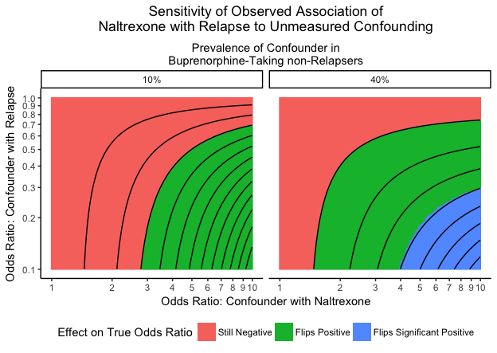

### Comparative Effectiveness of Naltrexone and Buprenorphine: Letter Supplement

The Directed Acyclic Graph (DAG) below shows the setup of the Lee et al.
trial.

In per protocol analysis, we restrict to individuals who actually
initiate their medication. For patients assigned naltrexone, this
requires detoxification. Thus, assignment causes detox, and restricting
to initiators is equivalent to conditioning on completing detox. If
there is an unmeasured common cause of successful detox completion and
relapse, than detoxification is a collider. Conditioning on a collider
induces selection bias [(Hernan et al.,
2004!)](https://www.ncbi.nlm.nih.gov/pubmed/15308962). Here,
conditioning on successful detoxification in one trial arm opens a
"backdoor" association between naltrexone use and relapse.

The problem can be simplified by noting that, conditional on detox, the
hypothetical unmeasured variable has become a confounder: it is
associated with naltrexone use, it causes relapse, and it is not on the
causal pathway.

The degree of bias in the observed association between naltrexone and
relapse therefore depends on the strength of the association of the
unmeasured factor with naltrexone and relapse respectively. We can
explore the extent of this bias by simulating a hypothetical confounding
variable under different sets of assumptions about the strengths of the
confounder's respective association with naltrexone and relapse. The
ratio the odds ratio observed in the Lee et al. study to the "true" odds
ratio that would have been observed in an unconfounded study is a
measure of the degree of bias.

To conduct this analysis, we make the following simplifying assumptions:

1.  The unmeasured confounder is binary.
2.  The association of the unmeasured confounder with naltrexone does
    not depend on later relapse
3.  The association of the unmeasured confounder with relapse does not
    depend on naltrexone use

(2 and 3 are equivalent to "no effect modification.")

We then adopt a method similar to the one proposed by Arah and colleages
[(2008)](https://www-sciencedirect-com.proxy1.library.jhu.edu/science/article/pii/S1047279708000914).
Specifically, we reconstruct the 2-by-2 table for the per-protocol
analysis. We then separate data into two tables, stratified on a
hypothetical unmeasured variable associated with both naltrexone receipt
an relpse. Stratified tables are constructed by first specificying:

1.  The assumed prevalence of the confounder in the group that received
    buprenorphine and did not relapse;
2.  The assumed odds ratio for the confounder-naltrexone association;
3.  The assumed odds ratio for the confounder-relapse association.

By specifying these quantities, we an calcuate the value of each cell of
the stratified tables. Having now stratified on the unobserved
confounder, we calculate a Matel-Haenszel odds ratio for the association
of naltrexone with relapse, conditional on the unobserved confounder.

Implementation of this method is shown below.

    # Re-analysis of Lee Naltrexone trial

    # You will need to install these packages if you do not have them already
    # install.packages(dplyr)
    # install.packages(ggplot2)
    # install.packages(tidyr)
    library(dplyr)

    ## 
    ## Attaching package: 'dplyr'

    ## The following objects are masked from 'package:stats':
    ## 
    ##     filter, lag

    ## The following objects are masked from 'package:base':
    ## 
    ##     intersect, setdiff, setequal, union

    library(ggplot2)
    library(tidyr)

We begin by reproducing the Lee et al. dataset.

    #' We recreate the data, as reported by the Lee trial
    #' Notation T-bup0,trex1, D-detox-failure0,detox-success1, Y-survive0,relapse1
    #' Here is the data reported from the trial
    #' 1. T=1, D=1, Y=1: 106
    #' 2. T=1, D=1, Y=0: 98
    #' 3. T=0, D=1, Y=1: 150
    #' 4. T=0, D=1, Y=0: 120
    #' 5. T=1, D=0, Y=1: 79
    #' 6. T=1, D=0, Y=0: 0
    #' 7. T=0, D=0, Y=1: 13
    #' 8. T=0, D=0, Y=0" 4

    dat <- rbind(
      matrix(rep(c(1,1,1),106),ncol = 3,byrow = TRUE),
      matrix(rep(c(1,1,0),98),ncol = 3,byrow = TRUE),
      matrix(rep(c(0,1,1),150),ncol = 3,byrow = TRUE),
      matrix(rep(c(0,1,0),120),ncol = 3,byrow = TRUE),
      matrix(rep(c(1,0,1),79),ncol = 3,byrow = TRUE),
      matrix(rep(c(1,0,0),0),ncol = 3,byrow = TRUE),
      matrix(rep(c(0,0,1),13),ncol = 3,byrow = TRUE),
      matrix(rep(c(0,0,0),4),ncol = 3,byrow = TRUE)
    ) %>% as.data.frame()
    names(dat) <- c("treatment.assigned","detoxed","relapsed")

    # Check that the counts are consistent with those presented in the study
    nrow(dat)

    ## [1] 570

    dat %>% group_by(treatment.assigned) %>%
      summarise(
        treat = n(),
        detoxed = sum(detoxed),
        relapsed = sum(relapsed)
      )

    ## # A tibble: 2 x 4
    ##   treatment.assigned treat detoxed relapsed
    ##                <dbl> <int>   <dbl>    <dbl>
    ## 1                  0   287     270      163
    ## 2                  1   283     204      185

Here, we check that we can reproduce the authors' results.

    # Check we can reproduce the odds ratios reported in the study
    # ITT
    fit.itt <- glm(relapsed ~ treatment.assigned,data = dat, family = 'binomial')
    exp(c(coef(fit.itt)[2],confint(fit.itt)[2,]))

    ## Waiting for profiling to be done...

    ## treatment.assigned              2.5 %             97.5 % 
    ##           1.436084           1.024612           2.016922

    # PP
    fit.pp <- glm(relapsed ~ treatment.assigned,data = filter(dat,detoxed == 1), family = 'binomial')
    exp(c(coef(fit.pp)[2],confint(fit.pp)[2,]))

    ## Waiting for profiling to be done...

    ## treatment.assigned              2.5 %             97.5 % 
    ##          0.8653061          0.6005555          1.2463165

    # Compute the 2 by 2 for the per protocol analysis
    observed.pp.table <- with(filter(dat,detoxed == 1),table(treatment.assigned,relapsed))

    #' This is a function for conducting the sensitivity analysis to...
    #' unmeasured confounding using data provided...
    #' and any user-chosen set of assumptions.
    #' Start with: 
    #' 1. observed data, 
    #' 2. prevalence of confounder u in buprenorphine group that did not experience relpase, 
    #' 3. association of confounder with naltrexone use
    #' 4. association of confounder with relapse
    Sens <- function(tab,prev.u.bup.last,or.ut,or.uy) {
      # Sample size
      n <- sum(tab)
      
      # Get prevalence of those where confounder is not present, v, among those who took bup and lasted
      prev.v.bup.last <- 1 - prev.u.bup.last
      
      # Get prevalence of u and v in trex, last group from odds ratio
      odds.u.bup.last <- prev.u.bup.last/(1-prev.u.bup.last)
      odds.u.trex.last <- odds.u.bup.last*or.ut
      prev.u.trex.last <- odds.u.trex.last/(1 + odds.u.trex.last)
      prev.v.trex.last <- 1 - prev.u.trex.last
      
      # Get prevalence of u and v in bup, rellapse group from odds ratio
      odds.u.bup.lapse <- odds.u.bup.last*or.uy
      prev.u.bup.lapse <- odds.u.bup.lapse/(1 + odds.u.bup.lapse)
      prev.v.bup.lapse <- 1 - prev.u.bup.lapse
      
      # Get prevalence of u and v in trex, relapse group from both odds ratios
      odds.u.trex.lapse <- odds.u.bup.last*or.ut*or.uy
      prev.u.trex.lapse <- odds.u.trex.lapse/(1 + odds.u.trex.lapse)
      prev.v.trex.lapse <- 1 - prev.u.trex.lapse
      
      # Build two tables, with the data stratified on the confounder
      tab.u <- tab*matrix(c(prev.u.bup.last,prev.u.bup.lapse,prev.u.trex.last,prev.u.trex.lapse),ncol = 2,byrow = TRUE)
      tab.v <- tab*matrix(c(prev.v.bup.last,prev.v.bup.lapse,prev.v.trex.last,prev.v.trex.lapse),ncol = 2,byrow = TRUE)
      
      # Change data type to array, as needed for mantelhaen.test function
      tab.stratified <- array(c(as.vector(tab.u),as.vector(tab.v)),c(2,2,2))
      
      # Compute mantel-haenszel odds ratio and test to get unconfounded odds ratio
      test <- mantelhaen.test(tab.stratified)
      c(prev.u.bup.last,or.ut,or.uy,or.mh = test$estimate,p.mh = test$p.value)
      
    }

    #' This function implements the sensitivity analysis above, looping over...
    #' the user's chosen values, and presenting the results in a concsise format
    SensitivityAnalysis <- function(tab,prevalence,odds.ratios.ut,odds.ratios.uy){
      combs <- expand.grid(prevalence,odds.ratios.ut,odds.ratios.uy)
      out <- matrix(NA,nrow = nrow(combs),ncol = 5)
      for(i in 1:nrow(combs)){
        out[i,] <- Sens(tab,combs[i,1],combs[i,2],combs[i,3])
      }
      out <- as.data.frame(out)
      names(out) <- c("prevalence","or.ut","or.uy","or.mh","p")
      out$sig <- out$p < .05
      out$pos <- out$or.mh >1
      out$pos.sig <- ifelse(out$pos == FALSE,"Still Negative",ifelse(out$sig == FALSE,"Flips Positive","Flips Significant Positive")) %>% as.factor()
      out$pos.sig <- relevel(out$pos.sig,"Still Negative")
      out
    }

We run the sensitivity analysis for a range of confounder-naltrexone
odds ratios between 1 and 8; a range of confounder-relapse odds ratios
between 1 and 1/8; and confounder prevalences in the buprenorphine, no
relapse group of 10% and 40%.

    # Impelment sensitivity analysis, once for figure
    sensitivity.analysis.log <- SensitivityAnalysis(observed.pp.table,c(.1,.4),exp(seq(0,2.3,by = .02)),exp(seq(0,-2.3,by = -.02)))
    sensitivity.analysis.log$prevalence.text <- paste(sensitivity.analysis.log$prevalence*100,"%",sep = "")

The figure below shows a contour plot of the the results of the
sensitivity analysis. Coloring distinguishes three important regions:

1.  In the red region, stratifying on the unobserved confounder,
    naltrexone is preferred over buprenorphine, but the result is not
    statistically significant. consistent with the author's results.  
2.  In the green region, the odds ratio "flips," and bupprenorphine is
    preferred over naltrexone, but the result is not statistically
    significant.
3.  In the blue region, buprenorhpine is statistically significantly
    preferred over naltrexone.

When the confounding variable is fairly prevalent in the sample, an
unmeasured variable only modestly associated with increased naltrexone
use and reduced relapse risk could qualitatively change the association
observed by Lee et al. When the confounding variable is rare, stronger
associations would be required.

    # This figure is a more comprehensive, but possibly less intuitive, way of presenting the..
    # sensitivity analysis
    ggplot(sensitivity.analysis.log,aes(x = or.ut,y = or.uy)) +
      facet_grid(. ~ prevalence.text) +
      geom_raster(aes(fill = as.factor(pos.sig))) +
      geom_contour(aes(z = or.mh),colour = 'black') +
      xlab("Odds Ratio Confounder with Treatment") +
      ylab("Odds Ratio Confounder with Outcome") + 
      scale_x_log10(breaks = seq(1,10,by = 1),sec.axis = sec_axis(~.,name = "Prevalence of Confounder in\nBuprenorphine-Taking non-Relapsers",breaks = NULL,labels = NULL)) + 
      scale_y_log10(breaks = seq(.1,1,by = .1)) +
      scale_fill_discrete(name = "Effect on True Odds Ratio") +
      theme_classic() +
      theme(plot.title = element_text(hjust = .5),plot.subtitle = element_text(hjust = .5),legend.position = "bottom")

    ## Warning in min(x): no non-missing arguments to min; returning Inf

    ## Warning in max(x): no non-missing arguments to max; returning -Inf

    ## Warning in min(x): no non-missing arguments to min; returning Inf

    ## Warning in max(x): no non-missing arguments to max; returning -Inf

##### References

Hernán, M. A., Hernández-Díaz, S., & Robins, J. M. (2004). A structural
approach to selection bias. Epidemiology (Cambridge, Mass.), 15(5),
615–625.

Arah, O. A., Chiba, Y., & Greenland, S. (2008). Bias formulas for
external adjustment and sensitivity analysis of unmeasured confounders.
Annals of Epidemiology, 18(8), 637–646.
<https://doi.org/10.1016/j.annepidem.2008.04.003>
