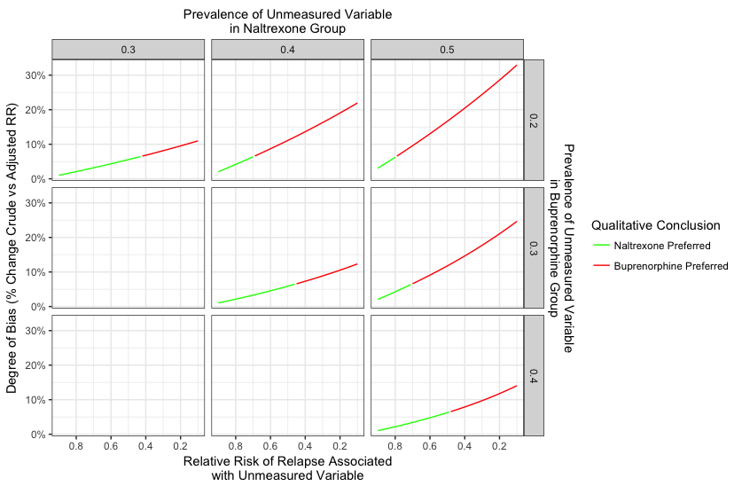

Comparative Effectiveness of Naltrexone and Buprenorphine: Letter Supplement
============================================================================

The Directed Acyclic Graph (DAG) below shows the setup of the Lee et al.
trial.

In per-protocol analysis, we restrict to individuals who actually
initiate their medication. For patients assigned naltrexone, this
requires detoxification. Thus, assignment causes detox, and restricting
to initiators is equivalent to conditioning on completing detox.
Detoxification would be a collider if there is a common cause of
successful detox completion and relapse that was not measured or not
adjusted for in the analysis. For example, greater capacity for
self-regulation or inhibitory control could both increase the chances of
successful detox and decrease the risk of relapse.

Conditioning on a collider induces selection bias [(Hernan et al.,
2004)](https://www.ncbi.nlm.nih.gov/pubmed/15308962). Here, conditioning
on successful detoxification in one trial arm opens a "backdoor"
association between naltrexone use and relapse.

The problem can be simplified by noting that, conditional on detox, the
hypothetical unmeasured variable behaves like a confounder: it is
associated with naltrexone use, it causes relapse, and it is not on the
causal pathway.

The degree of bias in the observed association between naltrexone and
relapse therefore depends on the prevalence of the unmeasured variable
in the naltrexone and buprenorphine taking groups, and the association
of the unmeasured variable with relapse. We can explore the extent of
this bias by simulating a hypothetical unmeasured variable under
different sets of assumptions about these parameters. We then can
estimate the "true" relative risk of relapse comparing naltrexone
initiators to buprenorphine initiatiors, had this unmeasured variable
been adjusted for.

To conduct this analysis, we make the following simplifying assumptions:

1.  The unmeasured variable is binary.
2.  The association of the unmeasured variable with relapse does not
    depend on treatment assignment among those who successfully initiate
    their drugs

We use the method of Lash and colleagues (2009), as implemented by the
"episensr" package in R [(Haine,
2018)](https://cran.r-project.org/web/packages/episensr/episensr.pdf).
Specifically, we begin by reconstructing the 2-by-2 table for the
per-protocol analysis. We then separate data into two tables, stratified
on a hypothetical unmeasured variable associated with both naltrexone
receipt an relapse. Stratified tables are constructed by first
specificying:

1.  The assumed prevalence of the unmeasured variable in the group that
    received buprenorphine;
2.  The assumed prevalence of the unmeasured variable in the group that
    received naltrexone;
3.  The assumed relative risk of relapse associated with the unmeasured
    variable.

By specifying these quantities, we can calcuate the value of each cell
of the stratified tables. Having now stratified on the unobserved
variable, we calculate an adjusted risk ratio for the association of
naltrexone with relapse, conditional on the unobserved variable.

Implementation of this method is shown below.

    # You will need to install these packages if you do not have them already
    # install.packages(dplyr)
    # install.packages(ggplot2)
    # install.packages(tidyr)
    # install.packages("episensr")
    library(dplyr)

    ## 
    ## Attaching package: 'dplyr'

    ## The following objects are masked from 'package:stats':
    ## 
    ##     filter, lag

    ## The following objects are masked from 'package:base':
    ## 
    ##     intersect, setdiff, setequal, union

    library(ggplot2)
    library(tidyr)
    library(episensr)

We begin by reproducing the Lee et al. dataset.

    #' We recreate the data, as reported by the Lee trial
    #' Notation T-bup0,trex1, D-detox-failure0,detox-success1, Y-survive0,relapse1
    #' Here is the data reported from the trial
    #' 1. T=1, D=1, Y=1: 106
    #' 2. T=1, D=1, Y=0: 98
    #' 3. T=0, D=1, Y=1: 150
    #' 4. T=0, D=1, Y=0: 120
    #' 5. T=1, D=0, Y=1: 79
    #' 6. T=1, D=0, Y=0: 0
    #' 7. T=0, D=0, Y=1: 13
    #' 8. T=0, D=0, Y=0" 4

    dat <- rbind(
      matrix(rep(c(1,1,1),106),ncol = 3,byrow = TRUE),
      matrix(rep(c(1,1,0),98),ncol = 3,byrow = TRUE),
      matrix(rep(c(0,1,1),150),ncol = 3,byrow = TRUE),
      matrix(rep(c(0,1,0),120),ncol = 3,byrow = TRUE),
      matrix(rep(c(1,0,1),79),ncol = 3,byrow = TRUE),
      matrix(rep(c(1,0,0),0),ncol = 3,byrow = TRUE),
      matrix(rep(c(0,0,1),13),ncol = 3,byrow = TRUE),
      matrix(rep(c(0,0,0),4),ncol = 3,byrow = TRUE)
    ) %>% as.data.frame()
    names(dat) <- c("treatment.assigned","detoxed","relapsed")

    # Check that the counts are consistent with those presented in the study
    nrow(dat)

    ## [1] 570

    dat %>% group_by(treatment.assigned) %>%
      summarise(
        treat = n(),
        detoxed = sum(detoxed),
        relapsed = sum(relapsed)
      )

    ## # A tibble: 2 x 4
    ##   treatment.assigned treat detoxed relapsed
    ##                <dbl> <int>   <dbl>    <dbl>
    ## 1                  0   287     270      163
    ## 2                  1   283     204      185

Here, we check that we can reproduce the authors' results.

    # Check we can reproduce odds ratios
    # ITT
    fit.itt <- glm(relapsed ~ treatment.assigned,data = dat, family = 'binomial')
    exp(c(coef(fit.itt)[2],confint(fit.itt)[2,]))

    ## Waiting for profiling to be done...

    ## treatment.assigned              2.5 %             97.5 % 
    ##           1.436084           1.024612           2.016922

    # PP
    data.pp <- filter(dat,detoxed == 1)
    fit.pp <- glm(relapsed ~ treatment.assigned,data = data.pp, family = 'binomial')
    exp(c(coef(fit.pp)[2],confint(fit.pp)[2,]))

    ## Waiting for profiling to be done...

    ## treatment.assigned              2.5 %             97.5 % 
    ##          0.8653061          0.6005555          1.2463165

    # Estimate the crude relative risk (since Lee et al. worked on odds raito scale)
    observed.pp.table <- with(data.pp,table(treatment.assigned,relapsed))
    observed.pp.table

    ##                   relapsed
    ## treatment.assigned   0   1
    ##                  0 120 150
    ##                  1  98 106

    observed.pp.table[2,2]/sum(observed.pp.table[2,])/(observed.pp.table[1,2]/sum(observed.pp.table[1,])) # Per protocol relative risk

    ## [1] 0.9352941

Now we implement the sensitivity analysis under different sets of
assumptions about the unmeasured variable:  
- We assume that the unmeasured variable reduces the risk of relapse by
somewhere between 10% and 90%, and examine all protective effects
between these extremes in 1 percentage point increments (e.g., 10%
reduction in risk, 11% reduction in risk, etc.).

-   We assume the prevalence of the unmeasured variable in the
    buprenorphine-initiator group was either 20%, 30%, or 40%; and the
    prevalence of the unmeasured variable in the naltrexone-initiator
    group was 30%, 40%, or 50%. Only cases where the unmeasured variable
    is more prevalent in the naltrexone group are examined. This is
    consistent with our concern that differential non-initiation between
    the groups caused a protective factor to be more prevalent among
    naltrexone-initiators.

<!-- -->

    #' Now we conduct our sensitivity analysis. We follow the methods of Lash et al., 2009, as employed in the episensr package
    #' The user chooses:
    #' 1. The prevalence of the unmeasured variable in the exposed
    #' 2. The prevalence of the unmeasured variable in the unexposed
    #' 3. The relative risk of relapse associated with the unmeasured variable 
    #' The analysis returns an estimate of the "standardized" relative risk, stratifying on the unmeasured variable

    # Define the parameters over which we will conduct the sensitivity analysis

    protective.effects <- seq(.1,.9,by = .01)
    prevalence.control <- c(.2,.3,.4)
    prevalence.treat <- c(.3,.4,.5)

    # Function for looping over parameters, conducting the sensitivity analysis, and extracting
    # ... the parameters of interest

    SensitivityAnalysis <- function(case,exposed,rr.yu,u.control,u.treated){
      # Parameters to be explored
      combs <- expand.grid(rr.yu,u.treated,u.control)
      names(combs) <- c("rr.yu","u.treated","u.control")
      combs <- filter(combs,u.treated > u.control)
      # Initialize output
      out <- matrix(rep(NA,6*nrow(combs)),ncol = 6)
      colnames(out) <- c("rr.yu","u.treated","u.control","true.rr","bias.degree","flip")
      for(i in 1:nrow(combs)){
        fit <- confounders(case = case,
                           exposed = exposed,
                           type = "RR",
                           bias_parms = combs[i,])
        out[i,] <- c(
          combs[i,1],
          combs[i,2],
          combs[i,3],
          fit$adj.measures[[1,1]],
          1 - fit$adj.measures[[1,2]],
          as.numeric(fit$adj.measures[[1,1]] > 1)
        )
      }
      as.data.frame(out)
    }

    sens <-  SensitivityAnalysis(data.pp$relapsed,
                        data.pp$treatment.assigned,
                        protective.effects,
                        prevalence.control,
                        prevalence.treat)
      
    # Example for letter

    filter(sens,u.treated == .4,u.control == .2,flip == 1) %>%
      slice(which.min(true.rr))

    ## # A tibble: 1 x 6
    ##   rr.yu u.treated u.control  true.rr bias.degree  flip
    ##   <dbl>     <dbl>     <dbl>    <dbl>       <dbl> <dbl>
    ## 1  0.69       0.4       0.2 1.001491  0.06609808     1

    # Create plot of all sensitivity analysis results
    ggplot(sens,aes(x = rr.yu,y = bias.degree,colour = factor(flip))) +
      facet_grid(u.control ~ u.treated) +
      geom_line() +
      scale_x_reverse(
        breaks = seq(0,1,by = .2),
        sec.axis = sec_axis(~.,name = "Prevalence of Unmeasured Variable\nin Naltrexone Group",breaks = NULL,labels = NULL)) +
      scale_y_continuous(
        labels = scales::percent,
        sec.axis = sec_axis(~.,name = "Prevalence of Unmeasured Variable\nin Buprenorphine Group",breaks = NULL,labels = NULL)) +
      xlab("Relative Risk of Relapse Associated\nwith Unmeasured Variable") +
      ylab("Degree of Bias (% Change Crude vs Adjusted RR)") +
      scale_colour_manual(
        name = "Qualitative Conclusion",
        values = c("green","red"),
        breaks = c(0,1),
        labels = c("Naltrexone Preferred","Buprenorphine Preferred")
      ) +
      theme_bw()

### Figure 1. Relative Risk of Relapse Comparing Naltrexone and Buprenorphine: Sensitivity of Observed Result to Unmeasured Variables

As shown above, if the prevalence of the unmeasured variable is similar
between groups, the variable would need to cause a fairly strong
reduction in relapse to qualitatively change the conclusion in Lee et
al. However, if the prevalence of the unmeasured variable is quite
different between groups then it would only need to modestly reduce the
risk of relapse to qualitatively change the study conclusions. If the
unmeasured variable had a strong effect on relapse, the observed
relative risk could be biased by more than 30%.

It is encouraging that none of the clinical characteristics presented by
Lee et al. in Table 1 differed between naltrexone-initiators and
buprenorphine-initiators by more than 10 percentage points.
Nevertheless, we think the scenarios explored in our analysis --
unmeasured variables that differ by much more than 10 percentage points
between groups -- remain plausible. This is because failure to initate
naltrexone was five times more common than failure to initiate
buprenorphine, and also because none of the clinical characteristics
examined is a clear proxy for the uneasured characteristic of interest
-- a participant's latent capacity to stop misusing opioids.

Finally, we must emphasize that our point is not that naltrexone is
necessarily inferior to buprenorphine. Indeed, as Lee and colleagues
note, Tanum and colleagues
[(2017)](https://doi.org/10.1001/jamapsychiatry.2017.3206) found that
naltrexone was not inferior to buprenorphine in a randomized trial of
Danish patients who had already completed a more lengthy period of
detoxification. Our point is only that the present per-protocol analysis
of treatment efficacy following initiation should be interpreted with
the same caution applied to any other observational study. This is
particularly true given the conclusions of Lee and colleagues' main
intent-to treat-analysis: that among patients who attempt to initiate
medication-assisted treatment while actively using opioids, asignment to
naltrexone treatment increases risk of relapse as compared to assignment
to buprenorphine.

##### References

Denis Haine (2017). episensr: Basic Sensitivity Analysis of
Epidemiological Results. R package version 0.9.2.
<https://CRAN.R-project.org/package=episensr>

Hernán, M. A., Hernández-Díaz, S., & Robins, J. M. (2004). A structural
approach to selection bias. Epidemiology (Cambridge, Mass.), 15(5),
615–625.

Lash, T. L., Fox, M. P., & Fink, A. K. (2011). Applying Quantitative
Bias Analysis to Epidemiologic Data. Springer Science & Business Media.

Tanum, L., Solli, K. K., Latif, Z.-H., Benth, J. Š., Opheim, A.,
Sharma-Haase, K., … Kunøe, N. (2017). Effectiveness of Injectable
Extended-Release Naltrexone vs Daily Buprenorphine-Naloxone for Opioid
Dependence: A Randomized Clinical Noninferiority Trial. JAMA Psychiatry,
74(12), 1197–1205. <https://doi.org/10.1001/jamapsychiatry.2017.3206>

VanderWeele, T. J. (2010). Bias formulas for sensitivity analysis for
direct and indirect effects. Epidemiology (Cambridge, Mass.), 21(4),
540–551. <https://doi.org/10.1097/EDE.0b013e3181df191c>
